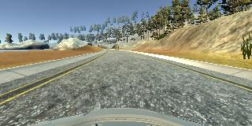

#**Behavioral Cloning** 

---

**Build a Behavioral Cloning Project**
##the approach taken for deriving and designing a model architecture fit for solving the given problem

###problem list
1,this project is a problem that according to the image then finding the driving angle

2,when the car is arriving the edge of the road, it must be pulled back to the center of the road

###solution
1,this is a computer vision problem to find features of the image, then according to the features to decide the trun angle of the car

2,deep neuron network is the way to find features. because of the function of convolutional network, the feature will be found in each size of the vision model

3,Flatten and Dense layer will be trained to calculate the output value of the angle  

##sufficient details of the characteristics and qualities of the architecture
1,keras is the greate deep neuron network model tool which can create a model easily

2,keras can use the generator to train data convenient way, and saving much memory and cpu compute resource

3,i choose the nvidia network for the project,the layers of the network is :

cropping layer

24 filters convolution with relu activation and (2,2)subsample 

48 filters convolution with relu activation and (2,2)subsample

64 filters convolution with relu activation

64 filters convolution with relu activation

Flatten layer

Dropout layer with 0.2

Dense 100 layer

Dropout layer with 0.2

Dense 50 layer

Dropout layer with 0.2

Dense 10 layer

Dropout layer with 0.2

Dense 1 layer

using adam optimizer and mse loss function

using the dropout layer is a great way to avoid overfit,

Dropout is a technique for addressing this problem. The key idea is to randomly drop units (along with their connections) from the neural network during training. This prevents units from co-adapting too much. During training, dropout samples from an exponential number of different “thinned” networks. 

##how the model was trained and what the characteristics of the dataset are
1,model traning is divid into 4 parts

2,first, traning the car is drived at the middle of road smoothly about 3 laps

2,second, traning the car how to recove from the right edge of road at every way the car failed

3,third, traning the car how to recove from the left edge of road at every way the car failed

4,four, traning the car how to trun left and right at the each place the car failed, the pictures below is traning the car how to trun left when meet the three-way intersection

then collecting more and more data, doing more and more training

finally the car will be drived successfuly at least one lap
